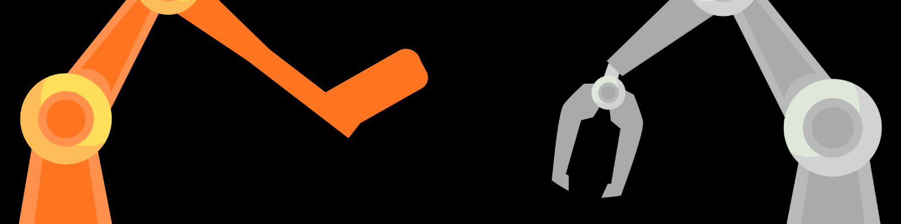
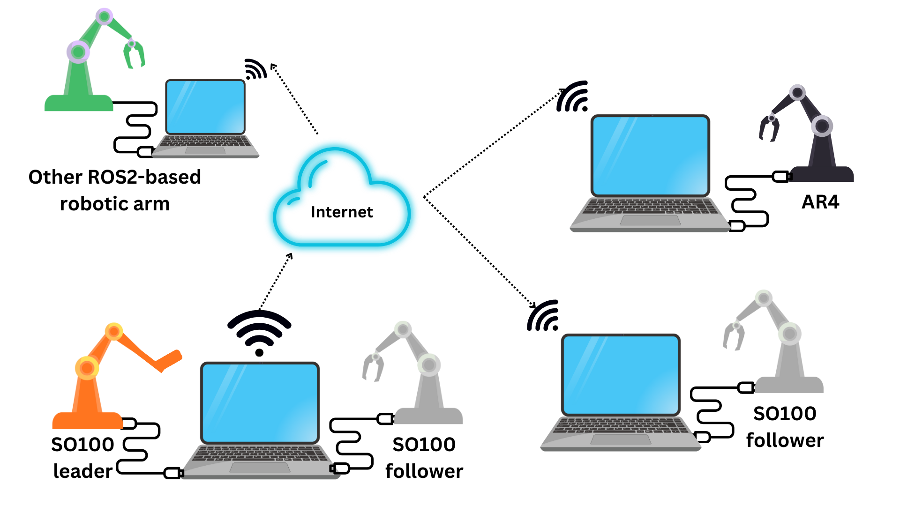
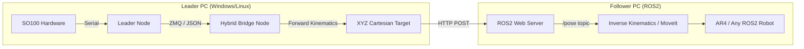

<center><h1>Real-time LeRobot Inference to ROS2 Cartesian Control Bridge</h1></center>
<!--
Created by Sandor Burian with the help of GitHub Copilot (Claude Sonnet 4)
-->

<center></img></center>

<p align="center">
   <a href="https://github.com/buriansandor/Real-time-LeRobot_Inference_to_ROS2_Cartesian_Control_Bridge/actions/workflows/pylint.yml">
      
   </a>
   <a href="https://www.python.org/downloads/">
      
   </a>
   <a href="https://pylint.pycqa.org/">
      
   </a>
   <a href="https://opensource.org/licenses/MPL-2.0">
      
   </a>

   <!--
   
   
   
   
   
   
   -->
</p>
<!--
[]()
[]()-->

**Available translations:** 
[](documentation_translations/hu-HU/README.md)

----

A comprehensive robotics control system for connecting SO100 leader robot to Annin AR4 follower robot with advanced inverse kinematics, cartesian coordinate control, and pick-and-place capabilities.

## 🚀 Features



### Core Functionality
- **Multi-Mode Operation**: Hardware (hard-coded), Hardware (URDF-based), and Simulation modes
- **Advanced Kinematics**: URDF-based inverse/forward kinematics using ikpy library
- **Cartesian Control**: Direct XYZ coordinate positioning with orientation control
- **Pick and Place**: Automated object manipulation with gripper control
- **Cross-Platform**: Full Windows, macOS, and Linux compatibility

### Robot Support
- **SO100 Leader**: 6-DOF arm with STS3215 servos, URDF model, CSV-based calibration
- **AR4 Follower**: Compatible with Annin AR4 robot ecosystem, ROS2 integration ready
- **Gripper Control**: Automated gripper handling with position feedback

### Professional Development
- **CI/CD Pipeline**: Automated code quality checking with GitHub Actions
- **Code Quality**: Pylint integration with robotics-optimized configuration
- **Comprehensive Documentation**: Full API documentation and usage examples
- **Modular Architecture**: Clean separation of concerns for easy extension


## 🗺️ Architecture



## 📁 Project Structure

```
Real-time-LeRobot_Inference_to_ROS2_Cartesian_Control_Bridge/
├── package/                          # Packaged modules & runtime scripts
│   ├── __init__.py
│   └── scripts/
│       ├── zmq_leader_node.py        # Leader communicator (ZMQ)
│       ├── zmq_hybrid_node.py        # Hybrid leader/follower bridge
│       └── ...                       # Other runtime helpers
├── demo/                             # Main demonstration & tools
│   ├── launcher.py                   # Multi-mode robot launcher (GUI/CLI)
│   ├── pickandplacetest.py           # Pick & place demo
│   ├── gripper_handler.py            # Gripper control abstraction
│   ├── test_*.py                     # Test and debug scripts
│   ├── SO100/
│   │   ├── so100_control_driver.py   # SO100 driver
│   │   ├── URDF/
│   │   └── calibration/              # CSV calibration files
│   └── AR4/
│       └── URDF/
├── kinematics/                       # Kinematic computation modules
├── visualization/                    # 3D visualization tools and viewers
├── documentation/                    # Images, guides and generated docs
├── documentation_translations/       # Translated docs (e.g., hu-HU)
├── tests/                            # Unit/integration test suite
├── .github/
│   └── workflows/                    # CI/CD pipelines (pylint, tests)
├── requirements.txt                  # Python dependencies
├── setup.py                          # Environment / install helper
├── LICENSE
└── README.md
```

## 🛠️ Installation

### Prerequisites
- Python 3.11 or higher
- Git

### Quick Setup

1. **Clone the repository**:
   ```bash
   git clone https://github.com/your-username/HFSO100_to_AnninAR4_connector.git
   cd HFSO100_to_AnninAR4_connector
   ```

2. **Set up Python environment** (cross-platform):
   ```bash
   python setup.py
   ```
   This automatically:
   - Creates a virtual environment (.venv)
   - Installs all required dependencies
   - Configures the development environment

3. **Activate the environment**:
   
   **Windows:**
   ```cmd
   .venv\Scripts\activate
   ```
   
   **macOS/Linux:**
   ```bash
   source .venv/bin/activate
   ```

### Manual Installation

If you prefer manual setup:

```bash
# Create virtual environment
python -m venv .venv

# Activate environment (Windows)
.venv\Scripts\activate
# OR activate environment (macOS/Linux)
source .venv/bin/activate

# Install dependencies
pip install -r requirements.txt
```

## 🎮 Usage

### Use the packaged version to control a local or a remote robotic arm
1. Start the HF SO100 leader arm
   - Connect the robotic arm to the computer
   - Start the leader listener with:
   ```bash
   python package/scripts/zmq_leader_node.py  
   ```
2. Start the hybrid node to transmit the calculated positions of the head:
   - With this one you can control a local and a remote robotic arm as well
   ```bash
    python package/scripts/zmq_hybrid_node.py  
   ```

3. Recieve the position on the remote ROS2-based robotic arm's host:
   ```bash
   python package/scripts/zmq_follower_node.py
   ```

   Or with ROS2 service call:
   ```bash
   ros2 service call /cartesian_control geometry_msgs/PoseStamped "{position: {x: 0.05, y: 0.02, z: 0.10}}"
   ```

   If using HTTP endpoint on the follower side:
   ```bash
   python package/scripts/ros2_http_bridge.py --port 8000
   ```

   Or locally on the same host send the same curl command to receive the cartesian coordinates.
   ```bash
   curl -X POST -H "Content-Type: application/json" \-d '{"x":0.05,"y":0.02,"z":0.10,"units":"m"}' \http://127.0.0.1:8000/pose 
   ```

### Main non-LeRobot-based Launcher

Start the multi-mode robot control system:

```bash
python demo/launcher.py
```

The launcher provides three operational modes:

1. **Hardware (Hard-coded)**: Uses pre-programmed kinematic equations
2. **Hardware (URDF-based)**: Uses URDF models for kinematic calculations  
3. **Simulation**: Virtual robot operation for testing and development

### Pick and Place Demo

Run the cartesian coordinate pick and place demonstration:

```bash
python demo/pickandplacetest.py
```

This demonstrates:
- Cartesian coordinate navigation (X, Y, Z positioning)
- Automated gripper control
- Safe trajectory planning
- Object manipulation workflows

### Individual Components

#### Robot Driver
```python
from demo.SO100.so100_control_driver import SO100ControlDriver

# Initialize robot with intelligent path resolution
robot = SO100ControlDriver()
robot.move_to_position([x, y, z, rx, ry, rz])
```

#### Gripper Control
```python
from demo.gripper_handler import GripperHandler

gripper = GripperHandler()
gripper.open_gripper()
gripper.close_gripper()
```

#### Kinematics
```python
from kinematics.urdf_based_kinematics_bridge import URDFBasedKinematicsBridge

kinematics = URDFBasedKinematicsBridge("demo/SO100/URDF/so100.urdf")
joint_angles = kinematics.inverse_kinematics([x, y, z, rx, ry, rz])
```

## 🔧 Configuration

### Calibration System

The robot uses CSV-based calibration for precise motor control:

- `follower_calibration.csv`: Main calibration parameters
- Motor offset adjustments for joint positioning
- "Candle" position calibration for vertical alignment

### URDF Models

- **SO100**: `demo/SO100/URDF/so100.urdf` - Base link: "base"
- **AR4**: `demo/AR4/URDF/ar4.urdf` - Base link: "base_link"

### Environment Variables

The system supports various configuration options through the launcher interface.

## 🧪 Testing

### Available Test Scripts

```bash
# Test inverse kinematics with cartesian coordinates
python demo/test_ik_cartesian.py

# Test motor direction and movement
python demo/test_motor_direction.py

# Test raw force feedback
python demo/test_raw_force.py

# Test gripper calibration
python demo/calibrate_gripper.py
```

### Development Testing

Run the complete test suite:

```bash
# Lint check
pylint demo/ kinematics/ --rcfile=.pylintrc

# Manual testing
python demo/simple_move_test.py
```

### **Environment Setup:**
```bash
# Activate virtual environment
# Windows PowerShell:
.venv\Scripts\Activate.ps1

# macOS/Linux:
source .venv/bin/activate

# Install additional packages
pip install <package-name>

# Update requirements
pip freeze > requirements.txt
```

## 🔬 Development

### Code Quality

This project maintains high code quality standards:

- **Pylint Score**: 10/10 maintained through CI/CD
- **GitHub Actions**: Automated testing on every commit
- **Code Style**: PEP 8 compliant with robotics-specific adjustments

### Architecture

The system follows a modular architecture:

1. **Control Layer**: Robot drivers and hardware interfaces
2. **Kinematics Layer**: Mathematical computation modules  
3. **Application Layer**: High-level control and demonstration scripts
4. **Utilities**: Helper functions and cross-platform compatibility

### Contributing

1. Fork the repository
2. Create a feature branch: `git checkout -b feature/amazing-feature`
3. Make your changes following the coding standards
4. Ensure all tests pass: `pylint your_changes/`
5. Commit your changes: `git commit -m 'Add amazing feature'`
6. Push to the branch: `git push origin feature/amazing-feature`
7. Submit a pull request

### Path Resolution

The system includes intelligent path resolution for cross-directory file access, ensuring calibration files and URDF models are found regardless of execution location.

## 📚 Dependencies

### Core Libraries
- **ikpy 3.4.2**: Inverse kinematics with URDF support
- **lerobot 0.4.2**: Robot learning ecosystem integration
- **numpy**: Numerical computations
- **matplotlib**: Visualization and plotting

### Development Tools
- **pylint**: Code quality analysis
- **pytest**: Testing framework (planned)

### Platform Support
- **Windows**: PowerShell and CMD support
- **macOS**: Bash and zsh compatibility  
- **Linux**: Full distribution support

## 🤖 Robot Specifications

### SO100 Leader Robot
- **DOF**: 6 degrees of freedom
- **Servos**: STS3215 series
- **Workspace**: Compact desktop robot arm
- **Communication**: Serial/USB interface
- **Calibration**: CSV-based parameter storage

### AR4 Follower Robot  
- **Compatibility**: Annin Robotics AR4 ecosystem
- **Integration**: ROS2 ready
- **Workspace**: Larger industrial-scale operation
- **Control**: Position and velocity control modes

## 🎯 Roadmap

### Completed ✅
- Multi-mode launcher system
- URDF-based kinematics integration
- Pick and place functionality
- Cross-platform compatibility
- CI/CD pipeline implementation
- Comprehensive calibration system

### Upcoming 🚧
- Advanced trajectory planning
- Computer vision integration
- Machine learning capabilities
- ROS2 full integration
- Web-based control interface

## 🐛 Troubleshooting

### Common Issues

1. **Import Errors**: Ensure virtual environment is activated
2. **URDF Loading**: Check file paths and model availability
3. **Calibration**: Verify CSV files are accessible
4. **Hardware Connection**: Check serial port permissions

### Debug Mode

Enable verbose logging in any script:
```python
import logging
logging.basicConfig(level=logging.DEBUG)
```

## 📄 License

This project is licensed under the MIT License - see the [LICENSE](LICENSE) file for details.

## 🙏 Acknowledgments

- **ikpy**: Excellent inverse kinematics library
- **LeRobot**: Robot learning ecosystem
- **Annin Robotics**: AR4 robot platform
- **Community**: Contributors and testers

---

**Project Status**: 🎉 Major milestone achieved - Full functional robotics control system with comprehensive documentation and CI/CD pipeline established. Ready for production use and further development.
