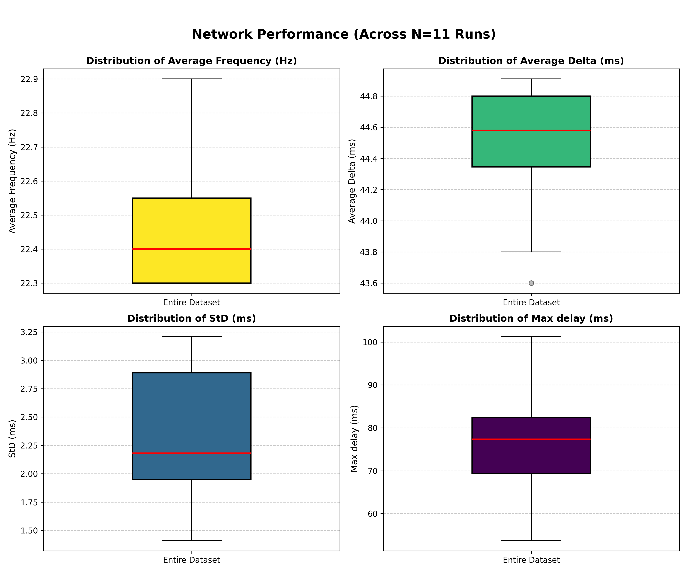
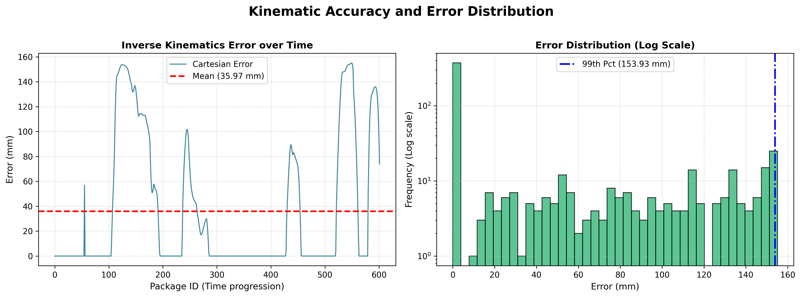

# Benchmark Results

This directory contains benchmark data for the Real-time LeRobot Inference to ROS2 Cartesian Control Bridge project.

## Overview

Performance benchmarking results comparing inference latency, control accuracy, and system resource utilization across different configurations.

The data were measured with:
- [teleop_benchmark.py](//teleop_benchmark.py)
- [kinematic_benchmark.py](//kinematic_benchmark.py)

## Results

Detailed benchmark results are available on **Kaggle**: [Benchmark Log Analysis of Real-time LeRobot2ROS2](https://www.kaggle.com/code/sndorburian/benchmark-log-analysis-of-real-time-lerobot2ros2)

## Analysis

The analysis script processes raw benchmark logs and generates performance metrics. Visit the Kaggle notebook above to explore interactive visualizations and detailed breakdowns.

## Visualizations

## Data Files

Raw benchmark logs and processed results are stored in this directory.

Also available at: 
- https://www.kaggle.com/datasets/sndorburian/benchmark-results-of-rtlri-to-ros2-cartesian/data
- https://www.kaggle.com/datasets/sndorburian/kinematic-benchmark-of-rtlri-to-ros2-cartesian/data
- https://www.kaggle.com/datasets/sndorburian/benchmark-with-kinematic-rtlri-to-ros2-cartesian/data